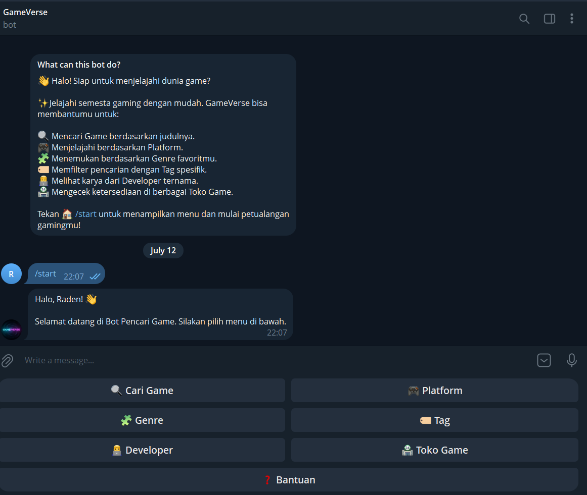
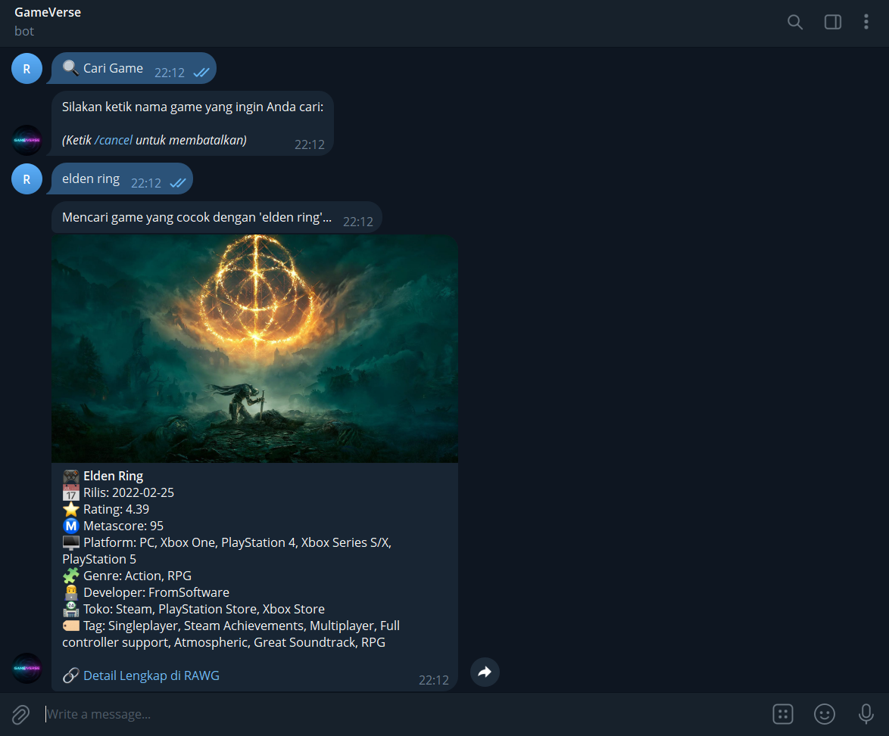
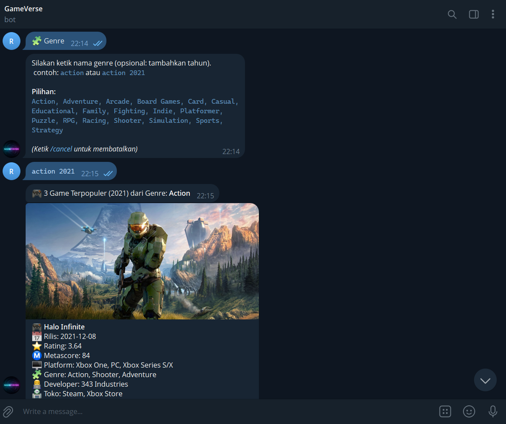
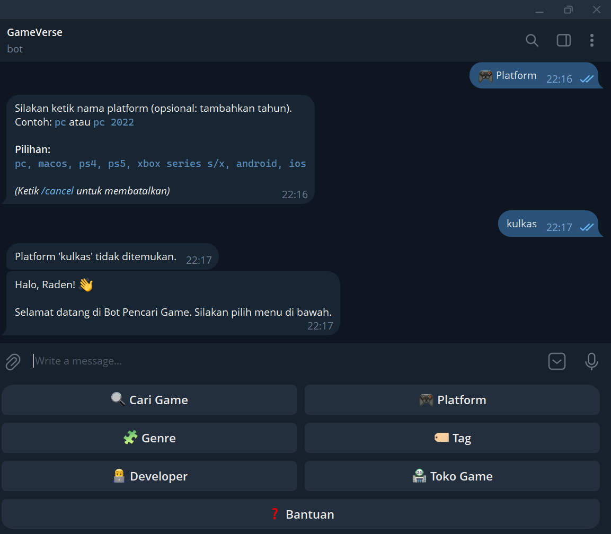

# Chatbot GameVerse

🚀 **Coba Langsung Bot-nya di sini:** [t.me/carigame_bot](https://t.me/UsernameBotAnda)

GameVerse adalah sebuah chatbot Telegram yang dirancang khusus untuk membantu Anda menemukan game favorit. Project ini dibangun menggunakan Python dan terintegrasi langsung dengan RAWG API untuk menyajikan database game paling update. Bot ini dirancang sebagai bagian dari skripsi untuk menunjukkan implementasi *Finite State Machine* (FSM) dalam interaksi pengguna.

## Arsitektur Sistem

Sistem ini dibangun dengan arsitektur **Finite State Machine (FSM)** menggunakan `ConversationHandler` dari `python-telegram-bot`. FSM memungkinkan bot untuk melacak di *state* (fase) mana percakapan dengan pengguna sedang berlangsung. 

Bot ini secara aktif mengambil data dari **RAWG Video Games Database API** (https://rawg.io) secara *real-time*. Semua request HTTP ke API RAWG dibungkus dengan *error handling* yang aman untuk mencegah *crash* saat server tujuan mengalami kendala atau terjadi masalah jaringan.

## Fitur

Bot memiliki beberapa menu utama:
- **🔍 Cari Game**: Untuk mencari game spesifik berdasarkan judulnya.
- **🎮 Platform**: Menampilkan daftar game populer untuk konsol atau platform tertentu.
- **🧩 Genre**: Mencari game berdasarkan genre yang Anda suka (RPG, Action, dll).
- **🏷️ Tag**: Pencarian super spesifik menggunakan tag (e.g. open-world, multiplayer).
- **👨‍💻 Developer**: Menampilkan game yang dikembangkan oleh developer tertentu.
- **🏪 Toko Game**: Melihat ketersediaan game di toko digital tertentu (Steam, Epic, PS Store).

*(Fitur tambahan: Pencarian menggunakan filter tahun rilis!)*

## Cara Instalasi & Menjalankan Lokal

1. **Clone repository ini** (jika belum).

2. **Buat Virtual Environment:**
   ```bash
   python -m venv venv
   # Di Windows:
   venv\Scripts\activate
   # Di Mac/Linux:
   source venv/bin/activate
   ```

3. **Install Dependensi:**
   ```bash
   pip install -r requirements.txt
   ```

4. **Setup Environment Variables:**
   - Salin file `.env.example` dan ubah namanya menjadi `.env`.
   - Buka file `.env` dan masukkan API Key Anda:
     ```env
     BOT_TOKEN=token_bot_telegram_anda
     RAWG_KEY=api_key_rawg_anda
     ```

5. **Jalankan Bot:**
   ```bash
   python bot.py
   ```

## Contoh Tampilan / Hasil Testing

Berikut adalah dokumentasi visual dari fitur-fitur utama bot:

### 1. Menu Utama & Navigasi Awal
*(Menampilkan respon saat user mengetik `/start` dan munculnya custom keyboard)*


### 2. Fitur Pencarian Game Spesifik
*(Menampilkan alur saat user menekan "Cari Game" dan bot membalas dengan detail lengkap sebuah game berserta gambarnya)*


### 3. Fitur Filter Canggih (Pencarian Berdasarkan Tahun)
*(Menampilkan kemampuan bot memfilter game berdasarkan genre/platform di tahun tertentu, misal: `rpg 2023`)*


### 4. Penanganan Error (Error Handling)
*(Menampilkan respon ramah bot ketika user memasukkan input yang salah atau ketika game tidak ditemukan)*

